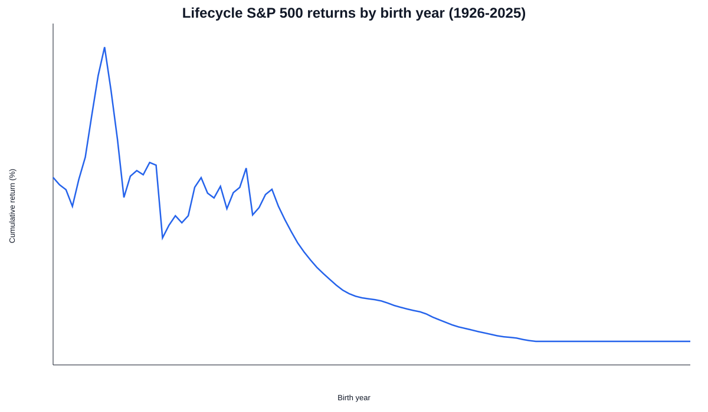

This simulation tracks **200 people**, one born in each year from **1826 to 2025**.

- Start investing at age **25**.
- Stop at age **65** (or hold through **December 2025** if not yet retired).
- Uses annual S&P 500 total returns (1926-2025) converted to smooth monthly growth.
- For cohorts whose labor-force entry starts before 1926, the simulation begins at **January 1926** (first available market return year in this dataset).

## Cohort outcomes at retirement/end date (monthly $1 investing)

Download: [Monthly cohort summary CSV](sp500_lifecycle_returns.csv).

## Interactive stacked lifecycle curves — monthly $1 investing

Hover with a cursor (desktop) or press a point (mobile touch) to view each point's **birth year**, **age**, and **portfolio value**.

